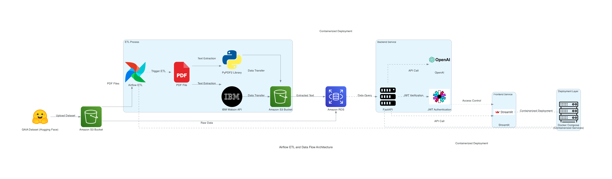

# Intelligent pdf extractor

## Project Overview
This repository contains the implementation of a PDF extraction and query tool, which automates the extraction of data from PDF files using PyPDF2 and IBM Watson Discovery API. The system is designed to allow users to securely interact with the extracted data through a client-facing application built with **Streamlit** and **FastAPI**. Apache Airflow orchestrates the data pipelines for efficient automation.

## Data Flow and Architecture
Below is an overview of the data flow and ETL architecture used in the project:



## Problem Statement
The primary goal is to automate the extraction and processing of text from PDF files, making it easily accessible for querying and analysis. The project reduces the need for manual data extraction, enhancing efficiency and user interaction.

## Project Goals
- **Automated Text Extraction**: Implement extraction pipelines using PyPDF2 (open-source) and IBM Watson (enterprise) tools.
- **User Authentication**: Secure user access with FastAPI and JWT authentication.
- **Data Storage**: Store extracted text in AWS S3 and RDS for structured queries.
- **User Interface**: Build a Streamlit-based interface to allow users to interact with the extracted data.
- **Deployment**: Use Docker Compose to containerize the application for deployment.

## Technologies Used
- **Apache Airflow**: Orchestrates the ETL pipeline for PDF processing.
- **IBM Watson Discovery**: Extracts structured data from PDFs.
- **AWS S3 & RDS**: Stores both raw and processed data.
- **FastAPI**: Manages user authentication and backend logic.
- **Streamlit**: Provides the frontend interface for data querying and interaction.
- **Docker**: Containerizes and deploys the system.
- **PyPDF2**: Performs open-source PDF text extraction.

## Repository Structure
```
├── Streamlit/                          # Streamlit application for frontend UI
├── fastapi/                            # FastAPI backend for user management and API services
├── images/                             # Project images and architecture diagrams
├── pipelines/                          # Airflow pipelines for PDF processing (PyPDF2 & IBM Watson)
├── .gitignore                          # Git ignore file
├── LICENSE                             # License information
├── README.md                           # Project documentation file
├── airflow_etl.ipynb                   # Jupyter notebook for ETL pipeline walkthrough
├── requirements.txt                    # Dependencies required for the project
└── s3_hf_gaia_data.py                  # Script for handling S3 data transfers
```

## Instructions for Running Locally
1. **Clone the repository**:
   ```bash
   git clone https://github.com/your-repo-name.git
   cd your-repo-name
   ```
2. **Create a virtual environment**:
   ```bash
   python -m venv myenv
   source myenv/bin/activate
   ```
3. **Install the requirements**:
   ```bash
   pip install -r requirements.txt
   ```
4. **Run the Streamlit application**:
   ```bash
   streamlit run Streamlit/dashboard.py
   ```

## Deployment
The application is containerized using Docker Compose. Run the following command to deploy:
```bash
docker-compose up
```

